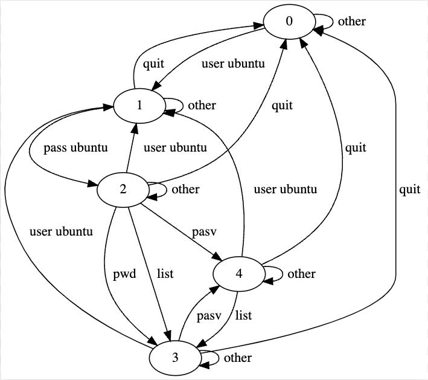

# state-coverage-monitor
C library to monitor the state coverage of your fuzzer.

## Overview
This library intercepts the messages between the SUT and a client (for example a fuzzer) to monitor:
- State coverage (in percentage)
- Number of times every state is hit
- Messages sent 

## Usage

1. Compile the library:
    > gcc -shared -fPIC coverage_library.c -o coverage_library.so -ldl

2. Link the library by using AFL_PRELOAD:
    > AFL_PRELOAD= ./coverage_library.so [commands to run your fuzzer or your SUT with the library]
    
    or LD_PRELOAD:
    > LD_PRELOAD= ./coverage_library.so [commands to run your fuzzer or your SUT with the library]

## Input
To monitor the state coverage of your SUT, the library needs the state mode of the SUT in input (in a .dot file).

This is the .dot file describing the LightFTP state model.

        digraph g {
            0 -> 1 [label="user ubuntu"]
            0 -> 0 [label="other"]
            1 -> 1 [label="other"]
            1 -> 2 [label="pass ubuntu"]
            1 -> 0 [label="quit"]
            2 -> 1 [label="user ubuntu"]
            2 -> 2 [label="other"]
            2 -> 3 [label="list"]
            2 -> 4 [label="pasv"]
            2 -> 0 [label="quit"]
            2 -> 3 [label="pwd"]
            3 -> 1 [label="user ubuntu"]
            3 -> 3 [label="other"]
            3 -> 4 [label="pasv"]
            3 -> 0 [label="quit"]
            4 -> 1 [label="user ubuntu"]
            4 -> 4 [label="other"]
            4 -> 3 [label="list"]
            4 -> 0 [label="quit"]
        }

The correspondent state model is:

## Output
Once you finish your testing, the file *output.txt* will contain all the information collected as follows:

    Total states discovered: 5 \ 5. State coverage: 100%. Messages sent: 3898
    State: 0 - Hit: 3302
    State: 1 - Hit: 350
    State: 2 - Hit: 49
    State: 3 - Hit: 149
    State: 4 - Hit: 48

## Limitations

This is a beta version of the library used for academic purposes. Thus, this version only overrides the functions **scanf**, **recv** and **send**.

